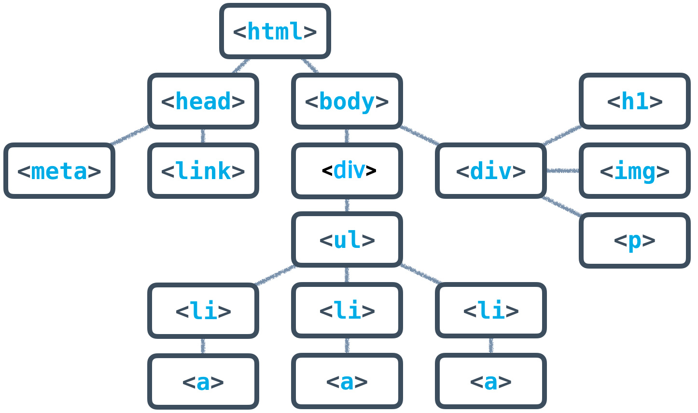

# Let's get hyper - with Hypertext Markup Language

Originally developed for academia, HTML is the de facto standart for creating the static visual level of websites and web applications.

To get started:

1. Install Lukas' [initializer](https://github.com/eMonk42/initializer/tree/develop)
2. `go-init git@github.com:valeriakori/css-katas.git`

## HTML Tag Structure

```html
<!-- regular tag -->

<tagname attribute="arrtibute-value">Contect</tagname>

<!-- if a tag has no content, 
tags can be converted into self-closing tags -->

<tagname attribute="arrtibute-value" />

<!-- Oh, btw, these are comments
They can strech multiple line. -->
```

### Most Common HTML tags

```html 
<!-- Markdown: 
#-###### Heading
-->
<h1>Heading 1</h1>
<h2>Heading 2</h2>
<h3>Heading 3</h3>
<h4>Heading 4</h4>
<h5>Heading 5</h5>
<h6>Heading 6</h6>


<!--Markdown: Paragraph with *emphasized text* and **emphasized text** -->
<p>Paragraph with <em>emphasized text</em> and <strong>strong text</strong></p>

<!--Markdown:  [Link (anchor)](https://some.domain.com)-->
<a href="https://some.domain.com">Link (anchor)</a>

<!--Markdown:  [Image Description](/url/to/image.png)-->


<!--Markdown: > Measuring programming progress by lines of code is like measuring aircraft building progress by weight.-->
<blockquote>How many programmers does it take to change a light bulb? None, that’s a hardware problem.</blockquote>

<!--Markdown:  
```js const add = (a, b) => a + b ```
-->
<code lang="javascript">const add = (a, b) => a + b</code>

<!--
Markdown:
* Unordered
* List
* Items
-->
<ul>
  <li>Unordered</li>
  <li>List</li>
  <li>Items</li>
</ul>

<!--
Markdown:
1. Ordered
2. List
3. Items
-->

<ol>
  <li>Ordered</li>
  <li>List</li>
  <li>Items</li>
</ol>

<!-- Line Break
Markdown: [Enter Key] (1 max.!) -->
<br />

<!-- Horizontal Rule/Line
  Markdown: --- or ___ -->
<hr />
```

### Embedding other pages: iframe

An iframe can be used to embed another external website into your page.
For example a youtube video:

```html
<iframe
  width="560"
  height="315"
  src="https://www.youtube.com/embed/3QhU9jd03a0"
  frameborder="0"
  allow="accelerometer; autoplay; encrypted-media; gyroscope; picture-in-picture"
  allowfullscreen
></iframe>
```

## Emmet

[Cheatsheet](https://docs.emmet.io/cheat-sheet/)

## CSS

Cascading Style Sheet: add styling to a webpage

### Syntax

CSS is composed out of rule sets. Each rule set starts with a selector which specifies for
which html elements the rules should apply followed by the rules:

```css
h1 {
  color: blue;
}
```

`h1` is called the selector. In this case all elements, that have the tag `h1`
are selected.

`color: blue;` is a rule. It sets the property `color` to the value `blue`.

### Including CSS in Html

Method 1: External style sheet added with a link tag inside `<head>`

```html
<link rel="stylesheet" href="styles.css" />
```

Method 2: Embedded style sheet inside `<head>` tag

```html
<style>
  h1 {
    color: blue;
  }
</style>
```

Inline Styles: You can also set properties directly on an element using the
`style` attribute.
This will overwrite any previously set rules.

```html
<h1 style="color: green;">A green heading</h1>
```

### Styling Text

```css
p {
  /* Text Color */
  color: black;
  color: #232323; /* RGB as hexadecimal values*/
  color: rgba(0, 0, 0, 0.75); /* RGB + Alpha for transparent text */
  color: hsl(180, 20%, 30%); /* Hue, Saturation, Lightness */

  /* Size */
  font-size: 16px; /* Pixel value */
  font-size: 2rem; /* 2 times the Root Font Size */

  /* Font Style */
  font-style: normal;
  font-style: italic;

  /* Weight */
  font-weight: normal;
  font-weight: bold;
  font-weight: 100; /* Extra Light */
  font-weight: 900; /* Black */

  /* Decoration */
  text-decoration: underline;
  text-decoration: none;
  text-decoration: line-through;

  /* Alignment */
  text-align: left;
  text-align: center;
  text-align: right;
  text-align: justify;

  line-height: 2;

  letter-spacing: 4px;
  word-spacing: 20px;
}

/* Lists */
ul {
  list-style-type: none;
  list-style-type: square;
  list-style-type: circle;
}
```

#### Using a custom font

We have to provide a link to the actual font in order to use it.

```css
@import url("https://fonts.googleapis.com/css2?family=Roboto&display=swap");
```

Then we can actually use the font using the `font-family` property, where we can
also provide fallback fonts, in case the link doesn't work.

```css
body {
  font-family: "Roboto", "Arial", sans-serif;
}
```

[Google Fonts](https://fonts.google.com/)

### Basic Selectors

**Universal Selector**: selects every element

```css
* {
}
```

**Tag Selector**: every element with matching tag

```css
p {
}
```

---

## Exercises

### Brain Dump

Which **elements** and **formatting options** do you remember from Markdown? What was their syntax?

### Text Analysis

Analyse the tags of these articles:
 * [UX Myths: People read on the web](https://uxmyths.com/post/647473628/myth-people-read-on-the-web)

 * [40 JavaScript Projects for Beginners](https://www.freecodecamp.org/news/javascript-projects-for-beginners/) (until the section **How to create a Counter**)

 * [Build Multiple Stacking Sticky Sidebars with Pure CSS and Bootstrap 4](https://scotch.io/tutorials/build-multiple-stacking-sticky-sidebars-with-pure-css-and-bootstrap-4/%7B%7Burl%7D%7D) (bookmark this one, it will come in really handy!!)


### Mock websites, not people

Create a [Figma account](https://www.figma.com) and create mockups, wireframes and layouts of your future websites!

### Game: CSS Diner
CSS Selector Game [CSS Diner](https://flukeout.github.io/)

### Pair Programming Article Writing

You are tasked to work in pairs to create a blog post informing people about interesting web development ressources. One student has the role of a copy writer with the idea for the content and the markup. They take the role of the navigator, providing the driver with information of the HTML structure and its contents:



* meta tag has the attributes: `name="author" content="[your names]"` (Documentation: [Mozilla](https://developer.mozilla.org/en-US/docs/Web/HTML/Element/meta), [w3schools](https://www.w3schools.com/tags/tag_meta.asp))
* the `link` links to a stylesheet called `styles.css`. Create the css file

* Links:
  * sasha.codes on Instagram https://www.instagram.com/sasha.codes/
  * #javascript30 Challenge https://javascript30.com/
  * Award Winning Websites https://www.awwwards.com/

* h1 --> Awesome Web Dev Resources
* img --> https://miro.medium.com/max/638/1*-tt1ynFdSbj9dn0lkQ4M4w.png
* text content: Sasha provides you with short but impactful nuggets of knowledge about CSS, Animations and UI Design. Wes Bos challenges you to do an HTML and CSS related JavaScript Challenge each day for a month! Find inspiration by loosing yourself between the beautiful sites on awwwards.

## Interesting articles and other ressources

* [](https://css-tricks.com/styling-underlines-web/)
* [](https://css-tricks.com/almanac/properties/t/text-decoration/)
* [](https://css-tricks.com/more-control-over-text-decoration/)
* [](https://css-tricks.com/almanac/properties/b/box-shadow/)
* [](https://www.youtube.com/watch?v=SlrzXQoVpK4)
* [](https://css-tricks.com/make-a-smooth-shadow-friend/)
* [](https://css-tricks.com/breaking-css-box-shadow-vs-drop-shadow/)