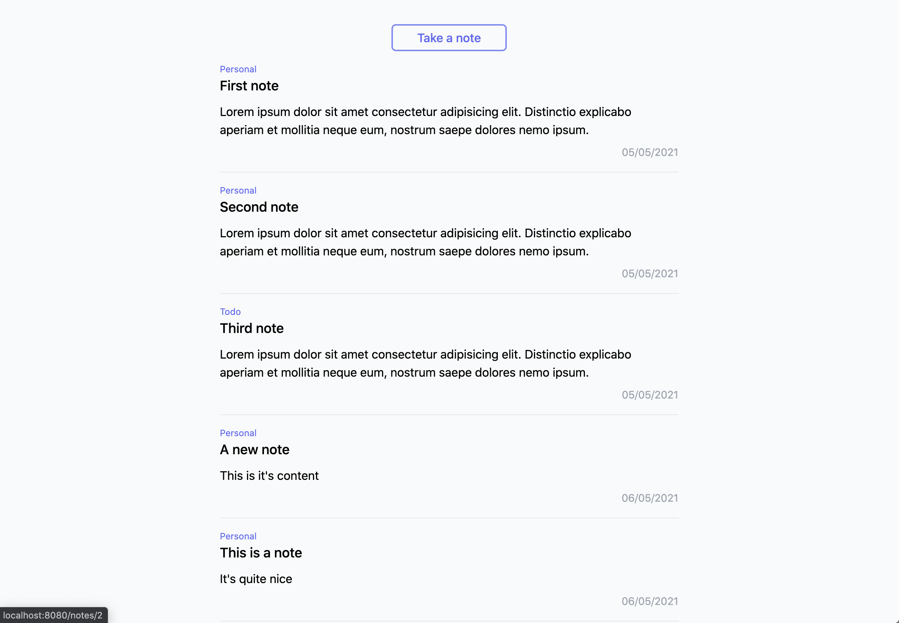
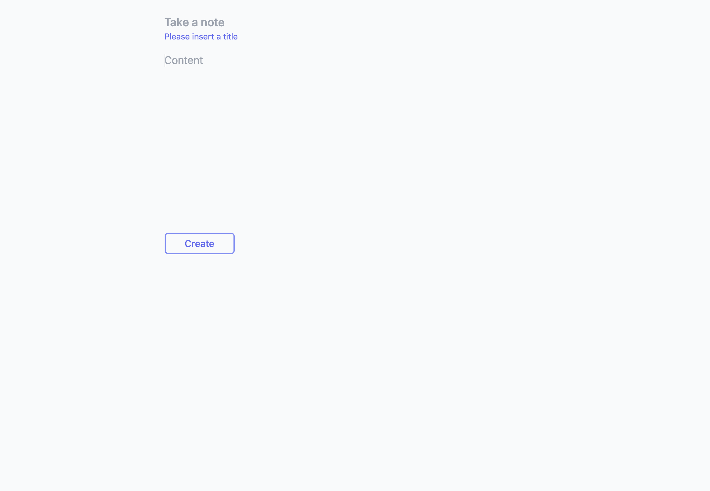

# Spark Create New Note Challenges

1. Route to Single Note View after create

   - Check how we are routing the user from the register to the Dashboard

2. Set createdBy to the user's id

   - The user id is stored in the Vuex store. `this.$store.state....`
   - You can check the Vue Devtools Vuex tab to look at the structure of the user object
   - Check out the types.ts file to see the expected structure of a note.

3. Set createdAt and updatedAt

   - Normally this will be set by the Backend, but for now we will do this locally
   - You can use `new Date()` to get the current time
   - Make sure that both createdAt and updatedAt are set to the exact same timestamp

4. Validate the title input (disallow empty title and show hint)

   - Don't only show the hint on submit, but also after first blur
   - Make sure to only submit if there are no errors

5. Catch and display submit errors

   - Show an error message below the submit button
   - Make sure to not route the user to a different page

6. Style Take Note button and CreateNote.vue

